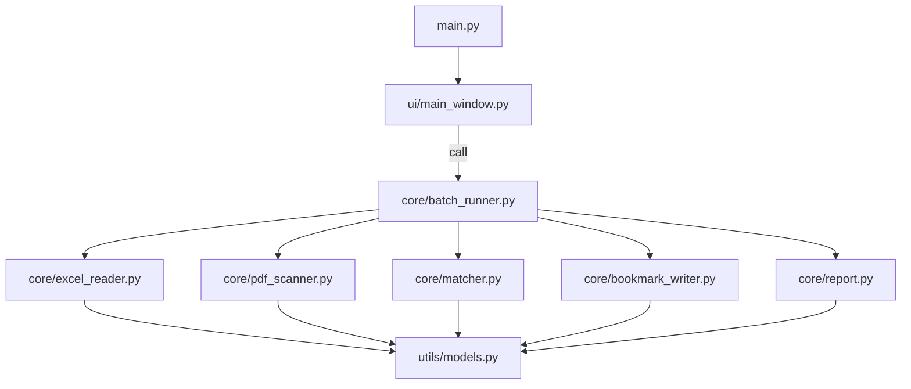

# Code Implementation Plan

This document captures the code structure: what files exist, what each file is
responsible for, and how they fit together.

---

## 1. Technology Choices

| Topic | Choice | Reason |
| --- | --- | --- |
| Language | Python 3.10+ | Excel and PDF libraries are the most mature here |
| Excel parsing | `openpyxl` | Lightweight; no need for pandas |
| PDF writing | `pypdf` | Actively maintained; supports outline read/write |
| GUI | `tkinter` (stdlib) | No extra dependency; fits a simple file-picker window |
| Distribution | `PyInstaller` | Produces a standalone Windows `.exe` that end users can double-click |

> Because this is a standalone local tool, there is no web-style
> "frontend / backend" split. The code is organized into **UI layer**,
> **business-logic layer**, and **utils layer**.

---

## 2. Directory Layout

```
pdf bookmark/
└── implementation/
    ├── PLAN.md                  # Overall feature plan
    ├── CODE_PLAN.md             # This file
    ├── README.md                # User and developer docs
    ├── requirements.txt         # Python dependencies
    ├── build.bat                # One-click rebuild script
    ├── main.py                  # Entry point, launches the GUI
    │
    ├── ui/                      # === UI layer (front end) ===
    │   ├── __init__.py
    │   └── main_window.py       # Tk main window: pickers, buttons, log
    │
    ├── core/                    # === Business-logic layer (back end) ===
    │   ├── __init__.py
    │   ├── excel_reader.py      # Read Excel -> FILENAME -> TITLE mapping
    │   ├── pdf_scanner.py       # Scan a folder for .pdf files
    │   ├── matcher.py           # Match Excel rows to PDFs
    │   ├── bookmark_writer.py   # Write a bookmark into one PDF
    │   ├── batch_runner.py      # Orchestrator
    │   └── report.py            # Produce the result .xlsx
    │
    ├── utils/                   # === Utility layer ===
    │   ├── __init__.py
    │   ├── logger.py            # Unified logger
    │   └── models.py            # Dataclasses shared across modules
    │
    └── samples/                 # Optional local sample data
```

---

## 3. Layer-by-Layer Notes

### Part 1: UI layer (`ui/`) - front end

Only responsible for GUI and user interaction; contains no business logic.

#### `ui/main_window.py`
Tkinter main window with these controls:

| Widget | Purpose |
| --- | --- |
| "Browse Excel..." button + path entry | Opens a file dialog filtered to `.xlsx / .xls` |
| "Browse Folder..." button + path entry | Opens a folder picker |
| "Precheck (no changes)" button | Reads + matches only; does not write anything |
| "Run (overwrite PDFs)" button | Full run that writes bookmarks |
| Log text box | Scrolling status messages |
| Status bar | Shows Ready / Working... |

Rules:
- The GUI only calls `core/batch_runner.py`; it does not import other core
  modules directly.
- Long-running work runs on a background thread to keep the UI responsive.
- Progress messages flow from core back to the UI through an `on_progress`
  callback.

---

### Part 2: Business-logic layer (`core/`) - back end

Six modules, each with a single responsibility.

#### `core/excel_reader.py`
Read the Excel file and return a `FILENAME -> FINAL_TITLE` mapping.

```python
def read_excel_mapping(excel_path: str) -> ExcelMappingResult:
    ...
```

Features:
- Locates the header row by scanning the first 10 rows for the required
  column names.
- Strips whitespace and skips empty rows.
- Tracks duplicate `FILENAME` values and empty-title rows.
- Tolerates `.xlsx` files whose `docProps/core.xml` has a malformed ISO date
  (fallback: rebuild the archive with a minimal core.xml before loading).

---

#### `core/pdf_scanner.py`
Scan a folder and return per-PDF metadata.

```python
def scan_pdf_folder(folder: str) -> list[PdfFileInfo]:
    ...
```

Features:
- Only scans the top level of the given folder.
- Captures page count, size, and any read errors without matching anything.

---

#### `core/matcher.py`
Tie Excel rows to PDF files.

```python
def match(mapping: dict, pdf_files: list[PdfFileInfo]) -> MatchResult:
    ...
```

Matching rule:
- Append `.pdf` to each Excel `FILENAME`.
- Compare by exact string equality against the real PDF file names.

Output buckets: `matched`, `unmatched_pdfs`, `missing_pdfs`, `conflicts`.

---

#### `core/bookmark_writer.py`
Write a bookmark into a single PDF.

```python
def write_bookmark(pdf_path: str, title: str) -> WriteResult:
    ...
```

Safety flow:
1. Read the source PDF with `pypdf`.
2. Copy pages into a new `PdfWriter`; add one top-level bookmark pointing at
   page 1.
3. Write to a `.bookmark.tmp` file next to the original.
4. Reopen the temp file and verify that the outline is present.
5. Atomically replace the original with `os.replace`.
6. Clean up the temp file on any failure.

---

#### `core/batch_runner.py`
Orchestrates the entire process. The UI layer should only call this module.

```python
def run_precheck(excel_path, folder, on_progress) -> BatchReport: ...
def run_full(excel_path, folder, on_progress) -> BatchReport: ...
```

Internal sequence:
1. `excel_reader.read_excel_mapping`
2. `pdf_scanner.scan_pdf_folder`
3. `matcher.match`
4. For each matched pair in `run_full`, call `bookmark_writer.write_bookmark`
5. Call `report.generate_report` to dump the `.xlsx`
6. Progress messages flow back through the `on_progress` callback

---

#### `core/report.py`
Produce the result Excel report.

```python
def generate_report(results: list[FileResult], output_folder: str) -> str:
    ...
```

Columns: `PDF File`, `Excel FILENAME`, `Bookmark Title`, `Status`, `Error`.
The `Error` column stays empty for successful rows; it is only populated when
something actually fails.

---

### Part 3: Utility layer (`utils/`)

#### `utils/models.py`
Dataclasses shared across modules: `PdfFileInfo`, `FileResult`, `MatchResult`,
`ExcelMappingResult`, `BatchReport`, etc. Also defines the `STATUS_*`
constants.

#### `utils/logger.py`
Thin wrapper around the stdlib `logging` module so that both the GUI worker
thread and developer scripts share the same output format.

---

### Part 4: Entry Point and Configuration

#### `main.py`
Does two things:
1. Makes sure the project root is on `sys.path` (important when frozen by
   PyInstaller).
2. Initializes the logger and launches `ui.main_window.launch()`.

#### `requirements.txt`
```
openpyxl>=3.1.0
pypdf>=4.0.0
pyinstaller>=6.5.0
```

#### `build.bat`
One-click rebuild: cleans previous `build/`, `dist/`, and `.spec` files,
installs dependencies, and runs PyInstaller with the right flags to produce a
GUI-only, single-folder distribution.

---

## 4. Module Dependency Graph



Key points:
- The UI depends on `batch_runner` only; other core modules are hidden from
  the UI.
- Core modules do not import each other; they share only the dataclasses in
  `utils/models.py`.
- This makes it trivial to swap out the GUI layer (for a CLI, for the Excel
  add-in, etc.) without touching the business logic.

---

## 5. Build and Distribution

1. Install `PyInstaller` (already listed in `requirements.txt`).
2. Run `build.bat` to regenerate `dist/PDF_Bookmark_Tool/`.
3. Zip that folder and send it to end users.
4. End users unzip the folder and double-click `PDF_Bookmark_Tool.exe`; no
   Python install is required.

---

## 6. Out of Scope for First Version

- Recursive folder scanning.
- Multi-level bookmarks.
- Fuzzy matching.
- Extracting titles from PDF content.
- Persisting the last-used paths between launches.
- Localization and theming.
