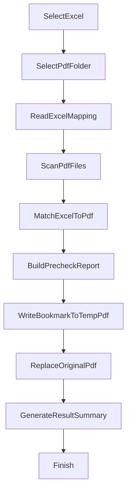

# Batch PDF Bookmark Tool - Feature Plan

## Goal
Build a standalone local tool with the following flow:
1. The user manually selects an Excel file.
2. The user manually selects a local PDF folder.
3. The program scans every PDF in that folder.
4. The program reads the bookmark titles for each PDF from the Excel file.
5. The program writes one "table" bookmark into each matched PDF.
6. The first version overwrites the original PDFs by default.

## Confirmed Requirements
- Output: overwrite the original PDF.
- Matching: the `FILENAME` in Excel only misses the `.pdf` extension compared
  to the real PDF file name. Everything else is identical, so the tool only
  needs to append `.pdf` and do an exact string comparison. No fuzzy matching.
- Title source: the `FILENAME` column maps to the PDF file, the `FINAL_TITLE`
  column is used as the bookmark title.
- PDF shape: the tables are expected to be single-page, but some real-world
  tables span multiple pages. A multi-page PDF is still treated as a normal
  case and gets a bookmark targeting page 1.

## Delivery Form
Ship as a standalone local tool (Python + lightweight Tk GUI), not as part of
the existing Excel add-in.

Reasons:
- The tool needs direct access to a local folder; a standalone tool is the
  simplest way to do that.
- Avoids the browser/Office add-in file-system sandbox.
- Once the first version is stable, it can still be packaged inside the Excel
  add-in later if needed.

## Feature Breakdown

### 1. Input Selection
- Pick an Excel file (only `.xlsx` and `.xls`).
- Pick a PDF folder (only `.pdf` files are processed).
- Show the chosen paths in the UI.
- Validate both inputs before running anything.

### 2. Excel Parsing
Read two columns from the first worksheet:
- `FILENAME`
- `FINAL_TITLE`

Requirements:
- Auto-detect the header row.
- Skip blank rows.
- Strip whitespace from each cell.
- Build a `FILENAME -> FINAL_TITLE` mapping.
- Record duplicate `FILENAME` values as conflicts.
- Record empty `FINAL_TITLE` rows as errors (no empty bookmarks written).

### 3. PDF Scanning
- Scan only the selected folder; no recursion in the first version.
- For each PDF, capture: name, full path, size, page count, initial status.
- Detect corrupted or encrypted PDFs and record the reason.

### 4. Matching
- Append `.pdf` to each Excel `FILENAME` and compare it against the real files
  in the folder using exact string comparison.
- Four possible outcomes per row:
  - Matched
  - Missing PDF (Excel has the row but the folder does not)
  - Unmatched PDF (the folder has the file but Excel does not)
  - Conflict (duplicated names on either side)
- The first version does not try to resolve conflicts automatically; it lists
  them and leaves the decision to the user.

### 5. Bookmark Writing
- Add exactly one top-level bookmark per matched PDF.
- Title = `FINAL_TITLE` value from Excel.
- Target = page 1 of the PDF.
- Any existing outline entries are dropped.

Safety flow when overwriting the original PDF:
1. Write a temporary file next to the original.
2. Verify that the temp file is readable and contains the bookmark.
3. Atomically replace the original using `os.replace`.
4. Delete the temp file on failure to leave the original untouched.

### 6. Batch Execution
Per-file states: `pending`, `matched`, `skipped`, `written`, `failed`.

Aggregated summary:
- Total scanned PDFs
- Total usable Excel rows
- Matched count
- Written count
- Failed count
- Unmatched PDF count
- Missing PDF count
- Conflict count
- Non-single-page PDF count (informational only)

Produce a `bookmark_result.xlsx` report with these columns:
`PDF File`, `Excel FILENAME`, `Bookmark Title`, `Status`, `Error`.

### 7. Minimal GUI
Sections:
- Input selectors (Excel + folder).
- Buttons: Precheck, Run, Clear Log.
- Scrollable log / progress area.
- Status bar (Ready / Working...).

### 8. Error Handling Checklist
- Excel: missing columns, malformed headers, empty titles, duplicate file
  names, file locked by another process, malformed document metadata.
- PDF: corrupted, encrypted, file locked, write-back failure.
- Matching: case differences, extension mismatch, duplicate names, Excel
  without matching PDFs, PDFs without matching Excel rows.
- Filesystem: no write permission, target file locked during replacement,
  temp-file swap failure, unrelated PDFs in the folder.

## Development Order
1. Freeze the requirements and prepare real sample data.
2. Core engine: Excel reading, PDF scanning, matching, bookmark writing.
3. Dry-run precheck (no file changes).
4. Real execution with the temp-file-and-replace flow.
5. Extras: recursive scanning, keep-existing-bookmarks mode, retry, auto
   backup.

## First-Version Scope
Supports:
- Manual selection of one Excel file and one folder.
- Flat folder scan (no recursion).
- One top-level bookmark per PDF.
- Title taken from `FINAL_TITLE`.
- Matching via appended `.pdf`.
- Overwrites the original PDF.
- Generates a result report.

Does not do:
- Multi-level bookmarks.
- Bookmark auto-detection from PDF content.
- Fuzzy matching.
- Complex GUI.
- Recursive folder scanning or multi-folder runs.
- Deep integration with the existing Excel add-in.

## Acceptance Criteria
- The Excel file loads successfully.
- The PDF folder is scanned successfully.
- Excel titles are matched correctly against each PDF.
- Each matched PDF gets a working bookmark that jumps to page 1.
- Errored rows are not overwritten, and the reasons are clearly reported.
- After the run, the user can see a clean success / failure summary.

## Flow Diagram

